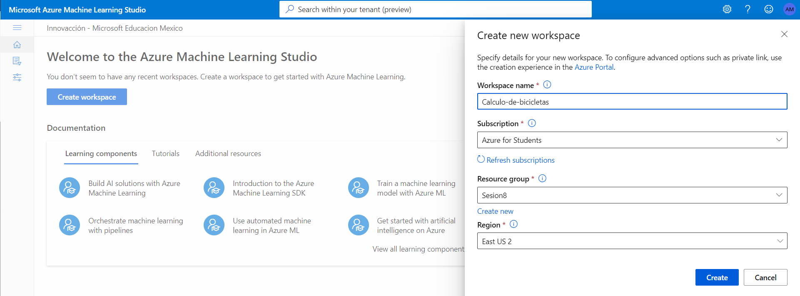
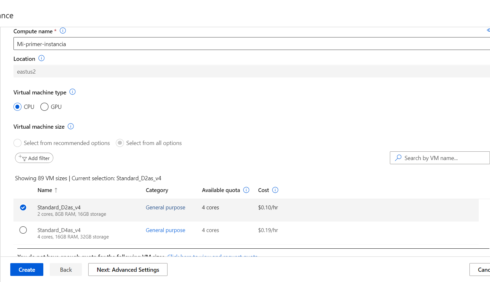
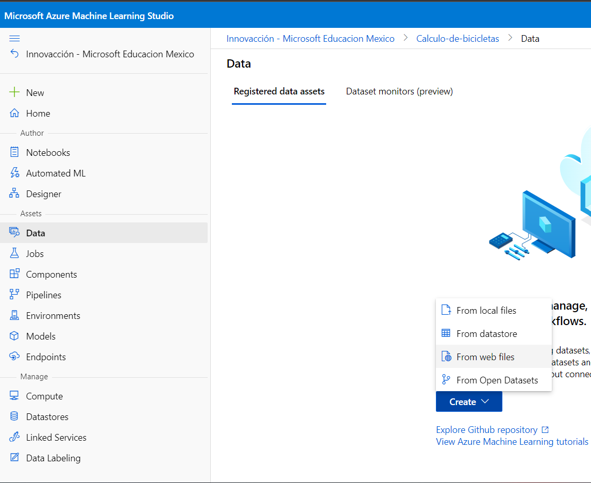
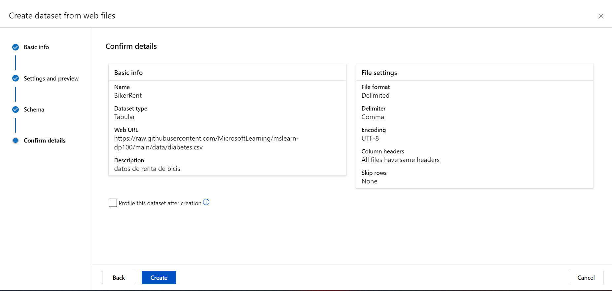
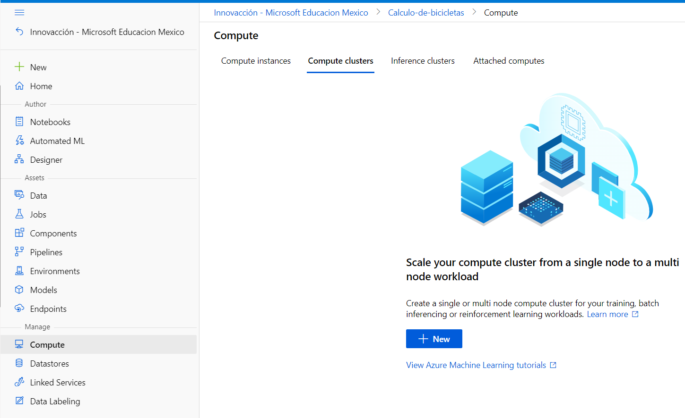
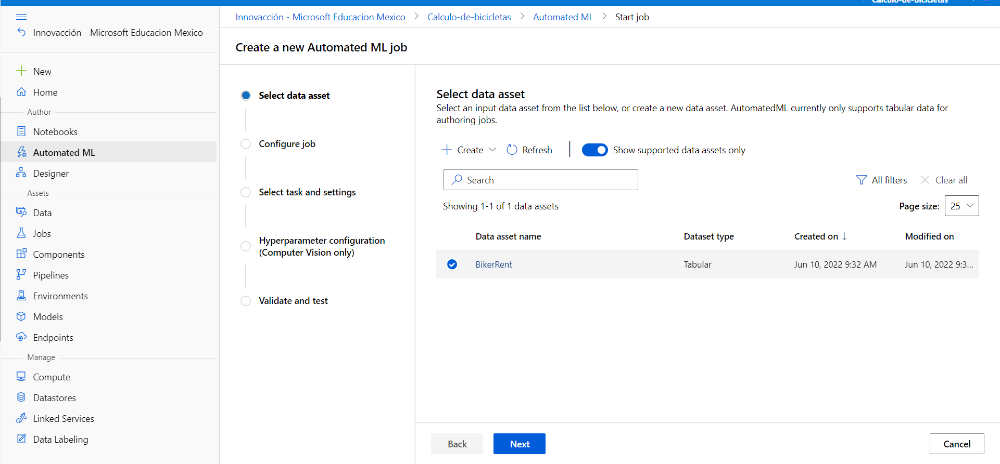
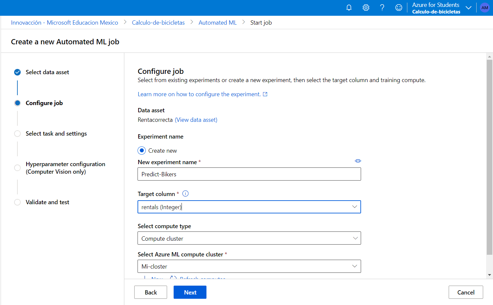
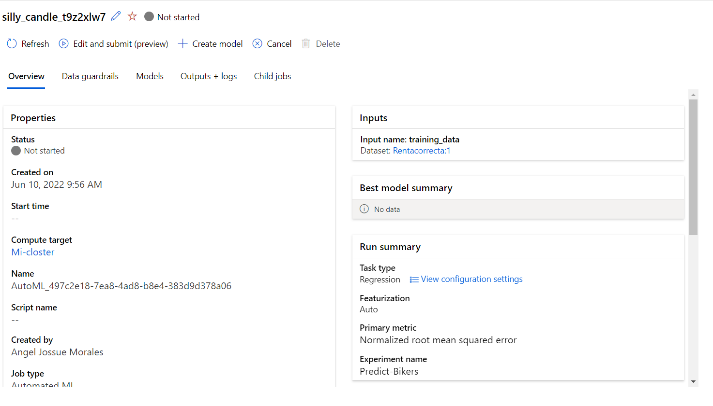

# En este apartado se vera como utilizar ML AUTO

- Primero iremos a la pagina de [ML Azure](https://ml.azure.com/home) y crearemos un area de trabajo

Una ves creado el grupo de trabajo (tardara entre 3 y 5 min) entraremos al recurso y buscaremos el apartado de proceso y crearemos una instancia de proceso (de igual manera se tardara entre 3 y 5 min)

Una ves creado la instancia de proceso no iremos al apartado de datos y crearemos un conjunto de datos seleccionando el apartado que deseemos para entrenar la IA

Lo crearemos dependiendo de nuestras necesidades

Ahora crearemos un "Closter de proceso" nos iremos al apartado de proceso y crearemo un closter de proceso (tardara entre 3 y 5 min)

Una ves creado nos iremos al apartado de "ML automatizado" y crearemos un nuevo trabajo de ML Automatizado (debemos escojer el archivo que acabamos de crear)

Cuando lo estemos creando deberemos escojer el closter de proceso que acabamos de crear

Listo ya hemos creado y entranado una IA para la renta de bicicletas

